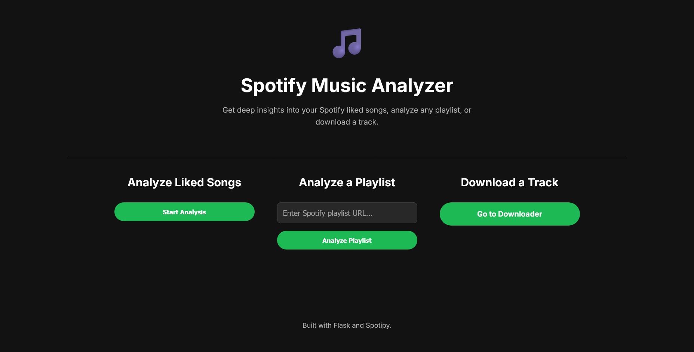

<p align="center">
  
</p>

<h1 align="center">Spotify Music Analyzer & Downloader</h1>

<p align="center">
  A sophisticated Flask web application to analyze your Spotify music library, discover insights about your listening habits, and download tracks for offline use.
</p>

<p align="center">
    
    
    
</p>

<p align="center">
  <a href="#-about-the-project">About</a> •
  <a href="#-key-features">Features</a> •
  <a href="#-live-demo">Live Demo</a> •
  <a href="#-tech-stack">Tech Stack</a> •
  <a href="#-getting-started">Getting Started</a> •
  <a href="#-usage">Usage</a> •
  <a href="#-project-structure">Structure</a> •
  <a href="#-legal-notice">Legal Notice</a>
</p>

---

## 📖 About the project

This project transforms the original command-line tool into a full-featured, modern web application using Flask. It provides a seamless user experience for securely authenticating with Spotify, running complex music analysis in the background, and downloading tracks directly from your browser. The entire interface is designed to be clean, intuitive, and responsive, with a focus on providing powerful features in a simple package.

The application leverages background threading to handle long-running processes like fetching thousands of songs or downloading large files, ensuring the user interface remains responsive. A live progress bar keeps the user informed, creating a smooth and interactive experience from start to finish.

---

## ⭐ Key features

### 🔍 Analyzer

- **Comprehensive statistics:** Get a full breakdown of your music library, including total tracks, unique artists, and total listening duration.
- **Top insights:** Discover your most-played artists, most common release years, and dominant genres.
- **Duplicate detection:** Easily find and manage exact duplicate tracks (same name and artist) in your liked songs or playlists.
- **Version discovery:** Identifies different versions of the same song (e.g., studio, live, acoustic, remastered) that share the same Spotify ID.

### 📥 Downloader

- **Direct URL downloading:** Download any Spotify track by simply pasting its URL.
- **Format selection:** Choose from multiple audio formats, including high-quality MP3 and lossless FLAC.
- **Quality control:** Select the desired bitrate for lossy formats to balance file size and audio quality.

### 🌐 Web interface

- **Secure Spotify OAuth:** A seamless and secure login flow that connects to your Spotify account without ever storing your password.
- **Background task processing:** Long-running analysis and download tasks are executed in the background, so your browser never freezes or times out.
- **Live progress bar:** A real-time loading bar shows the status of your task, from fetching data to completion.
- **Modern UI:** A clean, dark-themed, and minimalist interface designed for ease of use.

---

## 📸 Live demo

#### Analysis results page
The main results page, displaying a clean, table-based layout of your music statistics.  


#### Downloader page
The simple and intuitive interface for downloading tracks.  


#### Download success notification
The loading page transforms to show a download link once the background process is complete.  


---

## 🛠️ Tech stack

This project is built with a modern Python web stack:

- **Backend:** [Flask](https://flask.palletsprojects.com/)
- **Spotify integration:** [Spotipy](https://spotipy.readthedocs.io/)
- **Data manipulation:** [Pandas](https://pandas.pydata.org/)
- **Audio downloading:** [spotdl](https://github.com/spotdl/spotify-downloader)
- **Fuzzy matching:** [fuzzywuzzy](https://github.com/seatgeek/fuzzywuzzy)
- **Frontend:** HTML, CSS, Jinja2 templating

---

## 🚀 Getting started

Follow these steps to set up and run the project on your local machine.

### Prerequisites

- **Python:** 3.8+
- **Spotify account:** Free or Premium
- **Git:** For cloning the repository

### Installation

1. **Clone the repository**
   ```sh
   git clone https://github.com/ifauzeee/spotify-music-analyzer-downloader.git
   cd spotify-music-analyzer-downloader
   ```

2. **Create and activate a virtual environment**  
   This isolates the project's dependencies from your system.
   ```sh
   # Create the environment
   python -m venv venv

   # Activate on Windows (PowerShell)
   .\venv\Scripts\Activate.ps1

   # Activate on macOS/Linux
   source venv/bin/activate
   ```

3. **Install dependencies**  
   Install all required Python packages from the requirements file.
   ```sh
   pip install -r requirements.txt
   ```

4. **Set up Spotify API credentials**  
   Register an application on the Spotify Developer Dashboard to get API keys.

   - **Open dashboard:** https://developer.spotify.com/dashboard
   - **Create app:** Provide a name and description.
   - **Copy credentials:** Note your Client ID and Client Secret.
   - **Edit settings:** Add this Redirect URI exactly:
     ```
     http://127.0.0.1:8888/callback
     ```
   - **Save changes** on the dashboard.

5. **Configure environment variables**  
   Create a file named `.env` in the project root to store your API keys.

   ```env
   # .env
   SPOTIPY_CLIENT_ID="YOUR_CLIENT_ID_HERE"
   SPOTIPY_CLIENT_SECRET="YOUR_CLIENT_SECRET_HERE"
   SPOTIPY_REDIRECT_URI="http://127.0.0.1:8888/callback"
   ```

   > Note: The `.gitignore` is configured to prevent this file from being committed.

---

## 🎮 Usage

1. **Activate your virtual environment**
   ```sh
   # Windows (PowerShell)
   .\venv\Scripts\Activate.ps1

   # macOS/Linux
   source venv/bin/activate
   ```

2. **Run the Flask application**
   ```sh
   # Option A: Set FLASK_APP explicitly (recommended)
   set FLASK_APP=app.py            # Windows (CMD)
   $env:FLASK_APP="app.py"         # Windows (PowerShell)
   export FLASK_APP=app.py         # macOS/Linux

   flask run --port=8888
   ```

3. **Open your browser**
   - **Navigate to:** `http://127.0.0.1:8888/`
   - **Authenticate:** You will be redirected to Spotify for login and permissions.
   - **Return:** After granting access, you’ll be redirected back to the app.
   - **Explore:** Analyze liked songs or playlists, or use the downloader page.

---

## 📁 Project structure

```text
spotify-music-analyzer/
│
├── .env                 # (Ignored by Git) Your Spotify credentials
├── .gitignore           # Files and directories to be ignored by Git
├── README.md            # This file
├── requirements.txt     # Python dependencies
├── app.py               # Core Flask application logic and routes
├── config.ini           # Configuration for analysis parameters
│
├── src/                 # Source code for backend logic
│   ├── analysis.py      # Functions for data analysis
│   ├── auth.py          # Initial Spotipy client configuration
│   ├── config.py        # Helper to read config.ini
│   ├── data.py          # Functions for fetching data from Spotify API
│   └── database.py      # SQLite database and caching logic
│
├── static/              # Static web files
│   ├── style.css
│   └── downloads/       # (Created automatically) Default location for downloads
│
└── templates/           # HTML templates for the web interface
    ├── index.html
    ├── layout.html
    ├── downloader.html
    ├── loading.html
    └── results.html
```

---

## ⚖️ Legal notice

> [!CAUTION]
> The Downloader feature in this project likely violates the Spotify Terms of Service and potentially copyright laws. Spotify is a legal streaming service, and downloading its content without explicit permission is generally not permitted.
>
> This feature should be used solely for personal, experimental, and educational purposes. Do not use it for distribution, commercial gain, or other illegal activities. The author is not responsible for any misuse of this feature.
>
> The officially supported method for offline listening is through Spotify Premium.

---

## 🤝 Contributing

Contributions are welcome! If you have ideas for improvements or find a bug, please open an issue or submit a pull request.

1. **Fork the project**
2. **Create a feature branch**  
   `git checkout -b feature/AmazingFeature`
3. **Commit your changes**  
   `git commit -m "Add some AmazingFeature"`
4. **Push to your branch**  
   `git push origin feature/AmazingFeature`
5. **Open a pull request**

---

## 📄 License

This project is licensed under the MIT License. See the `LICENSE` file for details. This license applies to the source code of this project and grants no rights to any music content downloaded with this tool.
